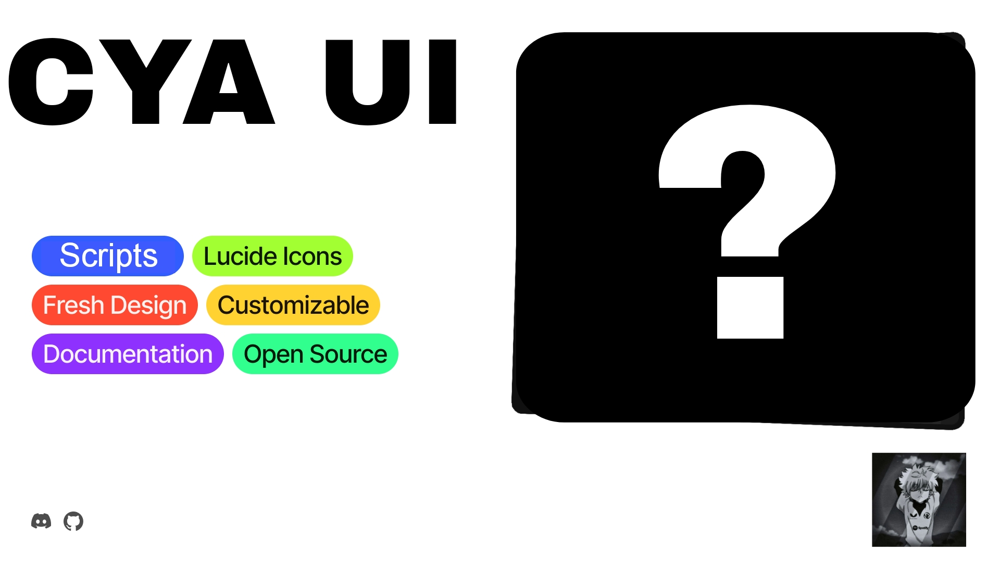

<!--<h1 align="center">WindUI</h1> -->

<picture>
    <source srcset="docs/banner-dark.webp" media="(prefers-color-scheme: dark)">
    <source srcset="docs/banner-light.webp" media="(prefers-color-scheme: light)">
    
</picture>

> [!WARNING]
> esta ui pode ser usada tanto para scripts como projetos executaveis que executam esta ui!

### Credits
- [PHGS](https://github.com/PHGS971) (programmer)
